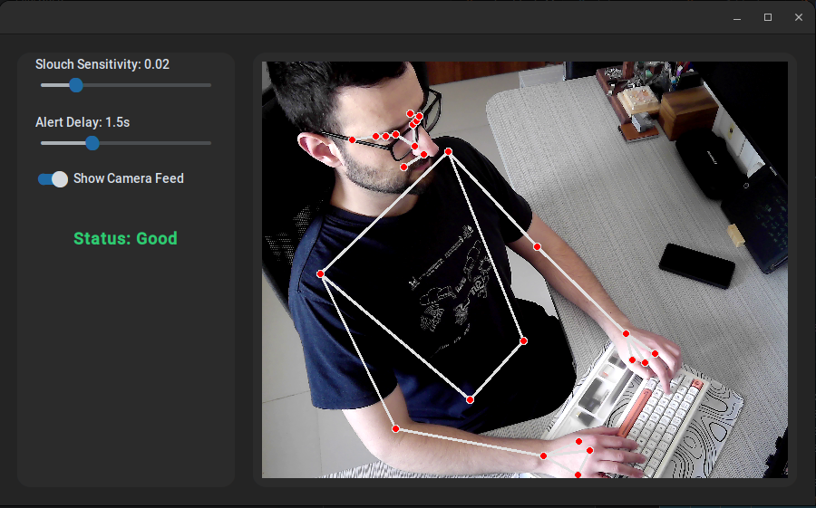
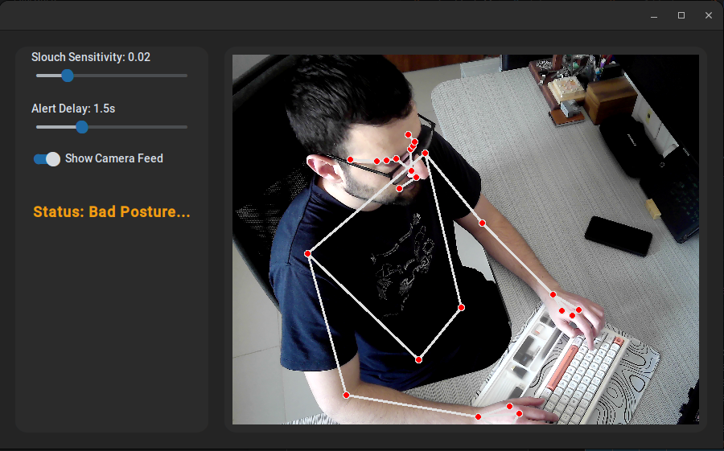
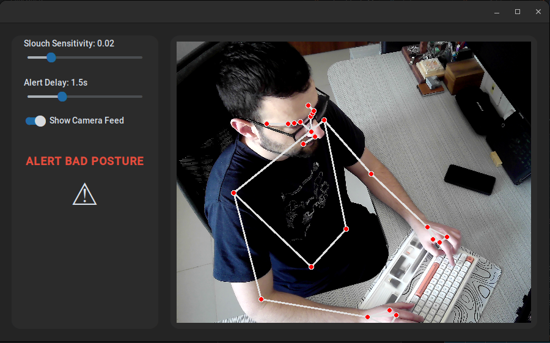

# 🪑 Posture Fixer

> *A real-time posture correction tool powered by computer vision — and a little behavioral psychology.*



---

## What It Does

Posture Fixer watches you through your webcam using Google's **MediaPipe** pose estimation. It tracks the position of your mouth corners relative to your shoulder line, and when you start to slouch — your head drops, the distance grows — the app notices. Wait too long, and it beeps.

That's it. Simple, local, no cloud, no subscriptions. Just a quiet sentinel sitting in the corner of your screen.

---

## The Pavlov Effect

Here's the thing I didn't expect when I built this.

After running it for a few weeks, something strange happened: **I started fixing my posture before the beep.**

Not because I was consciously thinking about it. The app had drilled a reflex into me. The sound — that short 880Hz tone — had become associated with the physical sensation of slouching. My brain, tired of being interrupted, started treating the *urge to slouch* as a warning signal all on its own.

It's a textbook [Pavlovian conditioning](https://en.wikipedia.org/wiki/Classical_conditioning) loop:

```
[Slouch] → [Beep] → [Straighten up]
    ↓
After enough repetitions:
[Slouch] → [Straighten up]   ← no beep needed
```

The app essentially trained me out of a bad habit by consistently pairing a behavior with an unpleasant stimulus. Over time, the stimulus became unnecessary — the association was already wired in.

I still run the app. But these days it barely fires.

---

## Screenshots

| Good Posture | Degrading | Full Alert |
|:---:|:---:|:---:|
|  |  |  |
| `Status: Good` ✅ | `Status: Bad Posture...` ⚠️ | `ALERT BAD POSTURE` 🚨 |

---

## How the Detection Works

The core metric isn't a simple head angle or neck distance. It's a **perpendicular distance** from your mouth corners to your shoulder line — calculated using a cross-product formula and normalized by shoulder width so it's scale-invariant (works whether you're close or far from the camera).

```python
# Vector representing the shoulder line (right → left)
dx = l_shoulder.x - r_shoulder.x
dy = l_shoulder.y - r_shoulder.y
line_length = math.sqrt(dx**2 + dy**2)

# Perpendicular distance from mouth corner to shoulder line
lm_x = left_mouth.x - r_shoulder.x
lm_y = left_mouth.y - r_shoulder.y
left_distance = (dx * lm_y - dy * lm_x) / line_length
```

When you sit upright, your mouth is well above the shoulder line. When you slouch, your head drops forward and down — that distance shrinks, and the metric catches it.

The threshold and delay are both user-configurable via sliders in the GUI.

---

## Features

- 🎥 **Live camera feed** with MediaPipe skeleton overlay
- 🎚️ **Adjustable slouch sensitivity** — tune it to your posture and camera angle
- ⏱️ **Configurable alert delay** — so brief dips don't spam you
- 🔊 **Audio alert** — a short sine-wave tone at 880Hz
- ⚡ **Frame-skip optimization** — AI runs every 2nd frame, skeleton draws every frame using cached results
- 📷 **Camera auto-fallback** — tries external cam first, falls back to built-in webcam
- 🖥️ **Compact mode** — hide the camera feed, keep just the status panel

---

## Architecture

```
posture-fixer/
├── main.py           # CLI / headless entry point
├── gui.py            # CustomTkinter desktop GUI
├── pose_utils.py     # MediaPipe pose detection + slouch math
└── camera_utils.py   # Camera initialization with fallback logic
```

```
camera_utils  ──→  gui.py / main.py
                       │
                   pose_utils
                       │
                  MediaPipe AI
```

---

## Installation

```bash
git clone https://github.com/BenLevintan/posture-fixer
cd posture-fixer
pip install -r requirements.txt
```

**Requirements:** `opencv-python`, `mediapipe`, `customtkinter`, `Pillow`, `numpy`, `sounddevice`

---

## Usage

**GUI mode** (recommended):
```bash
python gui.py
```

**Headless / terminal mode:**
```bash
python main.py
```

---

## Configuration

In `main.py`, tweak the `CONFIG` dictionary directly:

```python
CONFIG = {
    "diff_threshold": 0.02,  # Slouch sensitivity
    "camera_fps": 30,
    "time_delay": 1.5,        # Seconds before alert fires
    "sample_rate": 1          # Run AI every N frames
}
```

In the GUI, the sensitivity and delay are adjustable via sliders in real time.

---

## Tech Stack

`Python` · `OpenCV` · `MediaPipe` · `CustomTkinter` · `NumPy` · `SoundDevice` · `Pillow`

---

## License

MIT

---

*Built because my back hurt. Works better than I expected — for reasons I didn't anticipate.*
